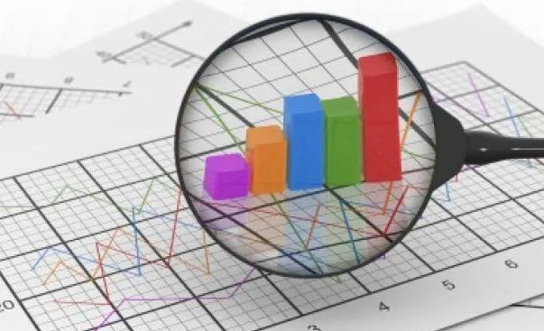

# History


## 소개

- 이름: 김희민
- 군필여부: 군필
- 취미: 게임, 헬스
- Email: khmdev87@gmail.com
- GitHub: [github.com/khmdev87](https://github.com/khmdev87)

```
좋은 엔지니어는 주인의식을 가진 엔지니어라고 생각합니다.
```

## 회사경력
- 삼성전자 (2013 ~ )

## 학력
- 을지대학교 의료전산 졸업 (2006 입학)

## 사용 기술 
### Backend
Rest API 서버를 구성할 수 있으며, 대규모 트래픽에 대응하여 서버 코드를 작성 할 줄 압니다.
Monolithic Architecture 환경 웹 애플리케이션을 만드는데 능숙 합니다.
또한 Terraform으로 인프라(IaC)를 구성하고 활용 할 수 있습니다.
- Java Spirng Boot, Java Spring webapp
- Python
- Groovy
- Jenkins 
- Terraform
- Presto
- Docker 

### CloudService
8년정도의 다양한 클라우드 서비스 솔루션을 사용하여 여러 서비스를 운영 해 보았으며, 요구사항에 맞추어 적절한 솔루션을 조합하여, 
서버 아키텍처를 구성하고 비용 효율화를 할 수 있습니다. 또한 대규모에서 발생되는 로깅을 활용하여 데이터 레이크를 구성 할 수 있으며, 
이를 활용하여 ETL 및 데이터 웨어하우스를 구축 할 수 있습니다.
- AWS EC2,ECS (EC2,Fargate)
- AWS CloudWatch, SNS, X-ray
- AWS Lambda
- AWS APIGateway
- AWS Kinesis (Stream,Firehose)
- AWS Aurora RDB, Elastic Cache, S3
- AWS Athena
- AWS Glue
- AWS Quicksight 
- GCP GKE
- GCP BigQuery


### Process
- 모니터링 - CloudWatch Dashboard/Insight, X-ray
- 커뮤니케이션 - Slack(사용할 줄 압니다), 대부분 회사 메신져 사용
- 이슈관리 - Github / Jira(애자일/스프린트/칸반)/ Confluence
- IAC - Terraform / Jenkins
- CI/CD - Jenkins / SonarQube
- 버전관리 - Git tag base

### TODO
대규모 트래픽을 다루고 그에 파생되는 빅 데이터 로그를 다루는 일은 즐거운 일입니다. <br/>
현재는 아래것들을 구축 하거나 또는 비용 효율화를 하고 있습니다.
- Webflux webapp에서 AWS X-ray 트래킹
- Firelense를 활용한 로깅 시스템 비용 감축 및 데이터레이크,데이터웨어하우스 구축

앞으로는 아래것들을 익히고 적용하려 합니다.
- GCP Pub/Sub, AWS SageMaker(ML)

## 프로젝트 이력


### Samsung SmartTV Ontv Service
- 소개 : 방송 프로그램 추천 및 CP의 메타데이터를 활용한 컨텐츠 추천
- 주요 업무 및 성과 : Rest API[C#] - 윈도우 서버 유지보수 업무, Jquery를 활용하여 시뮬레이터 개발, 배치모니터링 사이트 개발 
- 기간 : 2013.04 ~ 2015.03


### Samsung SmartTV Game Service
- 소개 : 게임 컨텐츠 제공 서비스, 게임 패널에서 국가별 게임 제공
- 주요 업무 : Rest API[C#](윈도우 서버) -> Java Spring Rest API 변경(리눅스 서버), 기존 온프레미스 RDB ->
AWS RDS 변경, Code 리팩토링, 코딩 컨벤션 작성, 개발 환경 공통화, CI/CD 구성(내부 시스템)
- 성과 : 개발 환경 공통화 및 개발내용 모든 내용 문서화 , 인프라 비용 전년대비 약 80% 절감
- 기간 : 2015.04 ~ 2016.12


### Samsung SmartTV Common Platform 
- 소개 : SmartTV에서 제공되는 여러 서비스를 공통적으로 관리하는 모듈 및 여러 서비스 API를 관리하는 게이트웨이 서버 제공 
- 주요 업무 및 성과 : API 게이트웨이 유지보수, AWS 람다를 이용한 광고추천 모듈 개발, TV 도난방지 시스템 구축 및 개발
- 기간 : 2017.01 ~ 2017.09



### Samsung SmartTV 데이터 분석 및 인사이트
- 소개 : SmartTV에서 서비스 Client or 서버에서 발생하는 다량의 이벤트 데이터를 취합하여, 분석 및 가공하여 PM or 의사결정자에게 인사이트 제공
- 주요 업무 및 성과 : 초창기 인프라 구조 설계, 데이터 분석 후 대시보드 개발(AWS Quicksight), GLue를 통한 파티셔닝 및 ETL 구성,
AWS athena 솔루션 도입 및 배치 개발, Terraform을 사용하여 IAC 관리 
- 기간 : 2017.09 ~ 2018.03


### Samsung SmartTV Universal Guide Service
- 소개 : 실시간 방송 추천(사용자 프로필 기반 및 시청이력), OTT 추천(사용자 프로필 기반), 가장 인기있는 프로그램 추천해주는 서비스
- 주요 업무 : 초기 인프라 구조 설계 (GCP,AWS) 및 솔루션 설계 (GKE,EKS,ECS), Terraform + Jenkins를 활용하여 IAC 자동관리, 초기 Rest API 스펙 설계 및 구현(Spring Boot)
MSA 환경에 맞는 HTTP Cache 도입, AWS X-ray Service Tracking 도입, 기존 Dashboard 솔루션 Quicksight로 변경, Jenkins CI/CD 구성(Groovy 스크립트 작성)
AB TEST 초기 설계 및 구현, AB Test Dashboard 설계 및 구현
- 성과 : 기존 인프라 비용 40% 절감, 성능에 문제가 있던 대시보드 40배 향상
- 기간 : 2018.04 ~ 현재


## 수상 경력
대학교때 여러 아이디어 공모전에 참여하여 수상한 이력이 있습니다. <br/>

#### 다날 대학생 아이디어 공모전 - 대상
- 수상 날짜 : 2011년 06월
- 참고 : 기사 링크 [http://www.dt.co.kr/contents.html?article_no=2011061702012169747002]

#### MBC 대한민국 앱 아이디어 공모전 - 장려상
- 수상 날짜 : 2011년 11월


----

여기까지 읽어주셔서 감사합니다. <br/>
부족한 부분이나 더 궁금하신 내용이 있다면 [이슈](https://github.com/khmworld/khm-history/issues)로 남겨주시겨나, khmdev87@gmail.com으로 연락주세요.<br/>
감사합니다.
